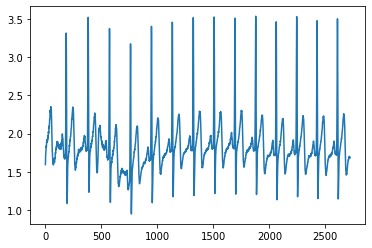
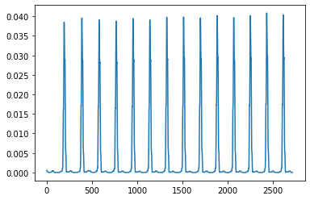

# Pan-Tompkins-algorithm-python

### About
The Pan–Tompkins algorithm is commonly used to detect QRS complexes in electrocardiographic signals (ECG). It based on paper in the [link](https://www.robots.ox.ac.uk/~gari/teaching/cdt/A3/readings/ECG/Pan+Tompkins.pdf).

### ECG QRS

The Pan–Tompkins algorithm applies a series of filters to highlight the frequency content of this rapid heart depolarization and removes the background noise. The paper suggests following pre-processing steps:

### Results

##### Raw ECG plot

##### Algorithm output plot

### Dependencies
- numpy
- Scipy

### How to use?
- Pan_tompkins_algorithm.py is required for using the algorithm. Import it in your working.  
- The class needs ECG data and its sampling rate (Hz) as inputs and it returns a signal which can be extended by finding peaks to get heart rate events.  
- Check the .ipynb notebook in the repo to get started.  
